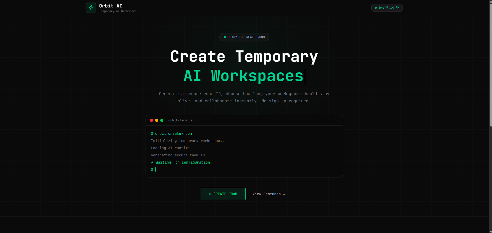
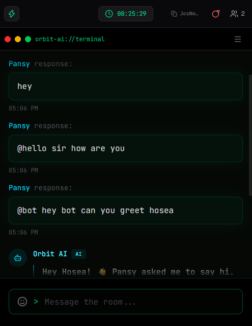
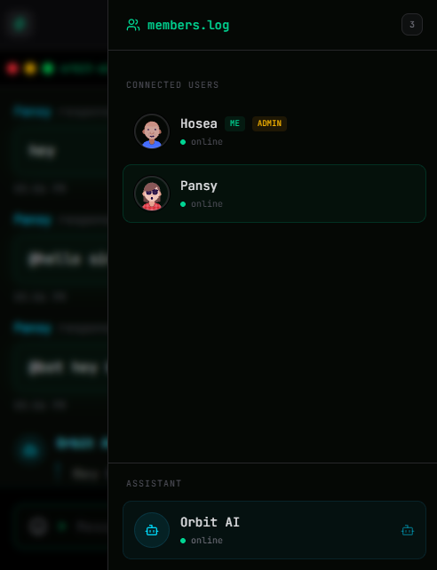
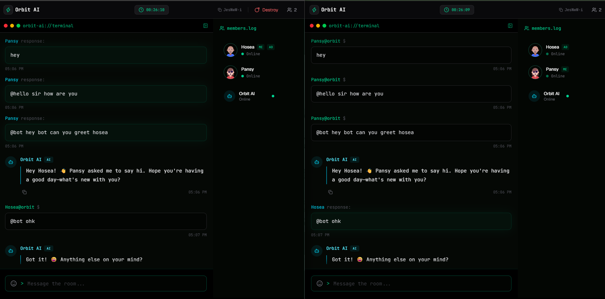

# ⚡ Orbit AI

<div align="center">

  <h3>Real-Time AI Chat & Collaboration Platform</h3>

  <p>
    Connect. Collaborate. Chat with AI.
  </p>

  <br />

  <div align="center">
    
    
    
    
    
    
    
  </div>

</div>

---

## ⚡ About Orbit AI

**Orbit AI** is a real-time AI-powered chat and collaboration platform where users can create rooms, invite other users, communicate in real time, and interact with an AI assistant.

The application combines **real-time communication, AI assistance, collaborative rooms, Redis-based scaling, and a Turborepo monorepo architecture**.

Users can join the same room and chat together while also interacting with **Orbit AI** for questions, coding help, and AI-powered assistance.

---

## 📸 Screenshots

### 🏠 Create Temporary AI Workspace

<p align="center">
  
</p>

### 💬 AI-Powered Room Chat

<p align="center">
  
</p>

### 👥 Members & AI Assistant

<p align="center">
  
</p>

### 🖥️ Real-Time Collaborative Workspace

<p align="center">
  
</p>

### video preview

<a href="https://youtu.be/13bv-vhB1Uo?si=_JLYoRdf7xUqJC4M">

 <div>Watch Orbit AI Demo</div>
</a>
---

## ✨ Features

- 🤖 **AI Chat**
  - Interact with Orbit AI directly inside a room.
  - Ask questions and get AI-powered coding assistance.
  - Powered by Groq.

- 💬 **Real-Time Group Chat**
  - Multiple users can join the same room.
  - Messages are delivered instantly using Socket.IO.

- 👥 **Collaborative Rooms**
  - Create a unique room.
  - Share the room ID with other users.
  - Multiple participants can collaborate together.

- ⚡ **Real-Time Communication**
  - Socket.IO handles real-time events.
  - Room events and messages are synchronized instantly.

- 🚀 **Horizontal Scaling**
  - Redis Socket.IO adapter allows communication across multiple server instances.
  - Designed for scalable real-time workloads.

- 🧠 **AI Assistant**
  - Mention `@bot` in chat to interact with Orbit AI.
  - Useful for coding questions and general assistance.

- ⏱️ **Temporary Rooms**
  - Rooms can have configurable durations.
  - Temporary Yjs documents can live in memory while users are connected.

- 🔄 **Real-Time Collaboration**
  - Yjs is used for collaborative document state.
  - Users can work together in real time.

- 📦 **Turborepo Monorepo**
  - Frontend and backend are organized as separate applications.
  - Shared development workflow through Turborepo.

---

# 🛠️ Tech Stack

| Technology           | Purpose                            |
| -------------------- | ---------------------------------- |
| ⚛️ **React**         | Building interactive UI components |
| ▲ **Next.js**        | Frontend framework and App Router  |
| 🔷 **TypeScript**    | Type-safe development              |
| 🔴 **Turborepo**     | Monorepo management                |
| 🔌 **Socket.IO**     | Real-time communication            |
| 🧠 **Yjs**           | Real-time collaborative state      |
| 🟥 **Redis**         | Pub/Sub and Socket.IO scaling      |
| ☁️ **Upstash Redis** | Managed Redis infrastructure       |
| 🤖 **Groq**          | AI inference and chat              |
| 🎨 **Tailwind CSS**  | UI styling                         |
| 🧩 **shadcn/ui**     | Reusable UI components             |
| 🟢 **Node.js**       | Real-time backend server           |

---

# 🏗️ Architecture

```text
                         ┌──────────────────────┐
                         │      Orbit AI        │
                         │      Next.js         │
                         └──────────┬───────────┘
                                    │
                                    │ Socket.IO
                                    ▼
                         ┌──────────────────────┐
                         │   Socket.IO Server   │
                         │       Node.js        │
                         └──────────┬───────────┘
                                    │
                     ┌──────────────┼──────────────┐
                     │              │              │
                     ▼              ▼              ▼
              ┌────────────┐ ┌────────────┐ ┌────────────┐
              │   Redis    │ │    Yjs     │ │    Groq    │
              │   Adapter  │ │   Docs     │ │     AI     │
              └────────────┘ └────────────┘ └────────────┘
                     │
                     ▼
              Multiple Server
                Instances
```

## ⚙️ Environment Variables

Create the required `.env` files and add the following environment variables.

| Variable              | Description                                                                          |
| --------------------- | ------------------------------------------------------------------------------------ |
| `SOCKET_URL`          | URL of the Socket.IO server used by the frontend to establish real-time connections. |
| `AI_API_KEY`          | API key used to authenticate requests to the AI provider.                            |
| `AI_MODEL`            | Specifies the AI model used by Orbit AI for generating responses.                    |
| `REDIS_URL`           | Redis connection URL used for real-time communication and Socket.IO scaling.         |
| `UPSTASH_REDIS_TOKEN` | Authentication token used to connect securely to the Upstash Redis instance.         |

### Example

```env
SOCKET_URL=http://localhost:8000

AI_API_KEY=your_ai_api_key
AI_MODEL=your_ai_model

REDIS_URL=your_redis_url
UPSTASH_REDIS_TOKEN=your_upstash_redis_token
```

# 🚀 Installation & Local Setup

Follow these steps to run **Orbit AI** on your local machine.

## Prerequisites

Make sure you have the following installed:

- Node.js 18+
- npm
- Git
- Upstash Redis Account

Verify installation:

```bash
node --version
npm --version
git --version
```

---

## 1. Clone the Repository

```bash
git clone https://github.com/monushah108/orbit-ai.git
```

Navigate to the project directory:

```bash
cd orbit-ai
```

---

## 2. Install Dependencies

Install all dependencies from the root of the monorepo:

```bash
npm install
```

---

## 3. Configure Environment Variables

### Frontend

Create a file:

```text
apps/web/.env.local
```

Add:

```env
SOCKET_URL=http://localhost:8000
```

### Backend

Create a file:

```text
apps/server/.env
```

Add:

```env
SOCKET_URL=http://localhost:8000

AI_API_KEY=your_ai_api_key
AI_MODEL=your_ai_model

REDIS_URL=your_redis_url
UPSTASH_REDIS_TOKEN=your_upstash_redis_token
```

---

## 4. Start Development Server

From the project root:

```bash
npm run dev
```

Or:

```bash
npx turbo dev
```

---

## 5. Run Applications Individually

### Start Frontend

```bash
cd apps/web
npm run dev
```

Frontend will be available at:

```text
http://localhost:3000
```

### Start Backend

Open a new terminal:

```bash
cd apps/server
npm run dev
```

Backend Socket.IO server will run on:

```text
http://localhost:8000
```

---

## 6. Build for Production

```bash
npm run build
```

Or:

```bash
npx turbo build
```

---

## 7. Start Production Server

```bash
npm run start
```

Or run the backend directly:

```bash
cd apps/server
npm run start
```

---

## Project Structure

```text
orbit-ai/
│
├── apps/
│   │
│   ├── server/
│   │   │
│   │   ├── src/
│   │   │   ├── index.ts
│   │   │   ├── helper.ts
│   │   │   │
│   │   │   └── services/
│   │   │       └── ...
│   │   │
│   │   ├── dist/
│   │   ├── package.json
│   │   └── tsconfig.json
│   │
│   └── web/
│       │
│       ├── app/
│       │
│       ├── components/
│       │   ├── form/
│       │   │   ├── createRoom.tsx
│       │   │   ├── joinRoom.tsx
│       │   │   └── roomTerminal.tsx
│       │   │
│       │   ├── home/
│       │   │   ├── hero.tsx
│       │   │   ├── feat.tsx
│       │   │   ├── navbar.tsx
│       │   │   └── footer.tsx
│       │   │
│       │   └── workspace/
│       │       ├── workspace.tsx
│       │       ├── chatArea.tsx
│       │       ├── memberList.tsx
│       │       └── header.tsx
│       │
│       ├── context/
│       │   └── socketProvider.tsx
│       │
│       ├── socket/
│       │   ├── socket.ts
│       │   ├── chat.ts
│       │   └── room.ts
│       │
│       ├── store/
│       │   ├── useChatstore.ts
│       │   ├── useMemberstore.ts
│       │   └── useRoomstore.ts
│       │
│       ├── lib/
│       │   ├── randomUser.ts
│       │   └── utils.ts
│       │
│       ├── public/
│       ├── next.config.ts
│       ├── package.json
│       └── tsconfig.json
│
├── package.json
└── turbo.json
```

---

## You're Ready 🚀

Open:

```text
http://localhost:3000
```

Create a room, invite users, and start chatting with **Orbit AI** in real time.
